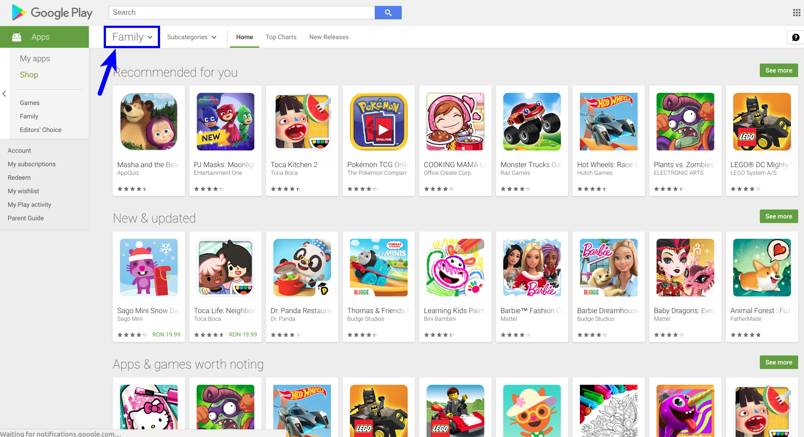

# profitable_app_profiles_app_store_google
xxx

## Summary

The aim is to find mobile app profiles that are profitable for the **App Store** and **Google Play** markets. The job is to enable our team of developers to make data-driven decisions with respect to the kind of apps they build.

We'll be mainly focusing with apps that are free to download and install, and our main source of revenue consists of in-app ads. This means that our revenue for any given app is mostly influenced by the number of users that use our app. Our goal for this project is to analyze data to help our developers understand what kinds of apps are likely to attract more users.

**The data**
- [App Store](https://www.kaggle.com/ramamet4/app-store-apple-data-set-10k-apps) containing data about approximately 7,000 iOS apps from the App Store; the data was collected in July 2017.

- [Google Play Store Apps](https://www.kaggle.com/lava18/google-play-store-apps) containing data about approximately 10,000 Android apps from Google Play; the data was collected in August 2018.

To make it easier for exploratory data analysis, a function is created with name explore_data() that you can repeatedly use to check data in a readable way.

```
def explore_data(dataset, start, end, rows_and_columns = False):
    dataset_slice = dataset[start:end]
    for row in dataset_slice:
        print(row)
        print("\n") # adds a new (empty) line after each row
        
    if rows_and_columns:
        print("Number of rows:", len(dataset))
        print("Number of columns:", len(dataset[0]))
```

The explore_data() function takes in four parameters: 
- dataset, which is expected to be a list of lists.
- start and end, which are both expected to be integers and represent the starting and the ending indices of a slice from the data set.
- rows_and_columns, which is expected to be a Boolean and has False as a default argument. It helps to print the number of rows and columns if rows_and_columns is True.



## Conclusions

In this project, we analyzed data about the App Store and Google Play mobile apps with the goal of recommending an app profile that can be profitable for both markets.

We concluded that taking a popular book (perhaps a more recent book) and turning it into an app could be profitable for both the Google Play and the App Store markets. The markets are already full of libraries, so we need to add some special features besides the raw version of the book. This might include daily quotes from the book, an audio version of the book, quizzes on the book, a forum where people can discuss the book, etc.
